# PicoClaw 架构图表文档

本文档包含 PicoClaw 项目的各种架构图表，使用 Mermaid 语法绘制。

---

## 1. 系统总体架构图

### 1.1 整体架构（C4 风格）


---

## 2. 消息处理流程图

### 2.1 消息处理序列图


### 2.2 工具执行流程图


---

## 3. 组件关系图

### 3.1 Agent 组件关系

```mermaid
classDiagram
    class AgentLoop {
        -bus: MessageBus
        -cfg: Config
        -registry: AgentRegistry
        -state: state.Manager
        -fallback: FallbackChain
        +Run(ctx) error
        +Stop()
        +ProcessDirect() string
        +ProcessHeartbeat() string
    }
    
    class AgentRegistry {
        -agents: map[string]*AgentInstance
        +Register(agent *AgentInstance)
        +GetAgent(id string) *AgentInstance
        +ResolveRoute() Route
    }
    
    class AgentInstance {
        -id: string
        -model: string
        -provider: LLMProvider
        -tools: tools.Registry
        -sessions: session.Manager
        -contextBuilder: context.ContextBuilder
    }
    
    class SessionManager {
        -sessions: map[string]*Session
        +AddMessage()
        +GetHistory() []Message
        +Save()
    }
    
    class ToolsRegistry {
        -tools: map[string]Tool
        +Register(tool Tool)
        +Execute() ToolResult
        +ToProviderDefs() []ToolDefinition
    }
    
    AgentLoop --> AgentRegistry
    AgentLoop --> SessionManager
    AgentRegistry --> AgentInstance
    AgentInstance --> ToolsRegistry
    AgentInstance --> SessionManager
```



### 3.2 Provider 架构


---

## 4. 通道集成架构

### 4.1 通道管理器架构


### 4.2 通道消息流


---

## 5. 会话管理流程

### 5.1 会话状态图


### 5.2 会话历史管理


---

## 6. 心跳任务流程

### 6.1 心跳任务序列图


### 6.2 子代理通信


---

## 7. 技能系统架构

### 7.1 技能加载流程


### 7.2 技能搜索流程


---

## 8. 路由系统

### 8.1 消息路由决策


---

## 9. 配置加载流程

### 9.1 启动配置流程


---

## 10. 错误处理流程

### 10.1 LLM 错误处理


---

## 11. 部署架构

### 11.1 本地部署


### 11.2 网关部署


---

## 12. 安全沙箱

### 12.1 工作区限制流程


---

## 13. 数据存储结构

### 13.1 工作区目录树


---

## 14. 版本与构建信息

### 14.1 发布流程

```mermaid
flowchart LR
    A[代码提交] --> B[CI 构建]
    B --> C{测试通过?}
    
    C -->|否| D[修复问题]
    D --> A
    
    C -->|是| E[构建多平台]
    E --> F[创建 Release]
    F --> G[上传 Assets]
    G --> H[用户下载]
```

### 14.2 版本号管理

```mermaid
flowchart TD
    A[v0.1.0] -->|功能增加| B[v0.2.0]
    B -->|重大变更| C[v1.0.0]
    C -->|bug修复| D[v1.0.1]
    D -->|新功能| E[v1.1.0]
    
    style A fill:#e1f5fe
    style B fill:#e1f5fe
    style C fill:#fff3e0
    style D fill:#e8f5e9
    style E fill:#e1f5fe
```
